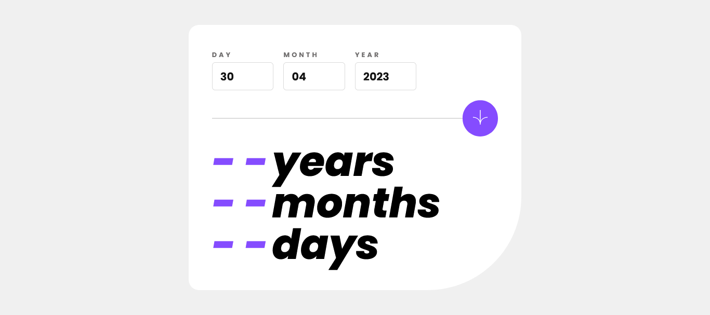

# Frontend Mentor - Age calculator app solution

This is a solution to the [Age calculator app challenge on Frontend Mentor](https://www.frontendmentor.io/challenges/age-calculator-app-dF9DFFpj-Q). Frontend Mentor challenges help you improve your coding skills by building realistic projects.

## Table of contents

- [Overview](#overview)
  - [The challenge](#the-challenge)
  - [Screenshot](#screenshot)
  - [Links](#links)
  - [Built with](#built-with)
  - [What I learned](#what-i-learned)
  - [Continued development](#continued-development)
  - [Useful resources](#useful-resources)
- [Author](#author)
- [Acknowledgments](#acknowledgments)

## Overview

### The challenge

Users should be able to:

- View an age in years, months, and days after submitting a valid date through the form
- Receive validation errors if:
  - Any field is empty when the form is submitted
  - The day number is not between 1-31
  - The month number is not between 1-12
  - The year is in the future
  - The date is invalid e.g. 31/04/1991 (there are 30 days in April)
- View the optimal layout for the interface depending on their device's screen size
- See hover and focus states for all interactive elements on the page
- **Bonus**: See the age numbers animate to their final number when the form is submitted

### Screenshot



### Links

- Solution URL: [Add solution URL here](https://your-solution-url.com)
- Live Site URL: [Add live site URL here](https://your-live-site-url.com)

### Built with

- Semantic HTML5 markup
- CSS custom properties
- Flexbox
- CSS Grid
- Mobile-first workflow
- Javascript

### What I learned

I was able learned about the min function in CSS and it made things a lot easier especially when setting the width of a containers.

```css
.main-container {
  width: min(100% - 2rem, 21.8em);
}
```

### Continued development

I like to continue working on my flexbox skill because during building this project I realized that there some concept I'm yet to understand. Henceforth, I will be focusing more on project that untilizes flexbox so that I can refine and perfect my flexbox skills

### Useful resources

- [MDN web docs](https://developer.mozilla.org/en-US/docs/Web/CSS/min) - This is an amazing website which helped me finally understand the min function in CSS. I'd recommend it to anyone still learning this concept.

## Author

- Frontend Mentor - [@dirudeen](https://www.frontendmentor.io/profile/dirudeen)
- Twitter - [@deenboi22](https://www.twitter.com/deenboi22)

## Acknowledgments

I would like to express my sincere appreciation to Fronted-Mentor for providing me with the invaluable opportunity to utilize their projects for practice and skill development as a frontend engineer. I am particularly grateful for the opportunity to receive feedback and learn from experienced mentors and fellow developers within the Fronted-Mentor community. The constructive criticism and encouragement have motivated me to constantly improve my work and strive for excellence. I am truly thankful for the exceptional learning and growth opportunities provided by Fronted-Mentor. It has been an invaluable resource for my professional development, and I am sincerely grateful for their commitment to nurturing the next generation of frontend developers.
